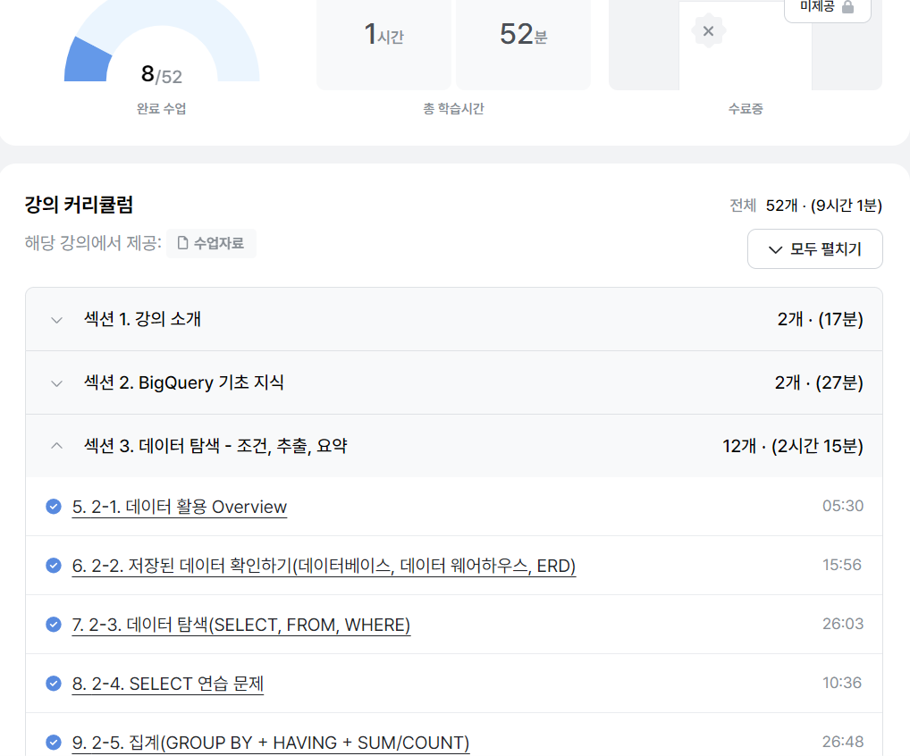

# SQL_BASIC 2주차 정규 과제 

📌SQL_BASIC 정규과제는 매주 정해진 분량의 `초보자를 위한 BigQuery(SQL) 입문` 강의를 듣고 간단한 문제를 풀면서 학습하는 것입니다. 이번주는 아래의 **SQL_Basic_2nd_TIL**에 나열된 분량을 수강하고 `학습 목표`에 맞게 공부하시면 됩니다.

**2주차 과제**는 1주차 과제처럼 SQL의 필요성이나 느낀점 위주가 아닌, **실제 강의 내용을 바탕으로 개념을 정리하고 학습한 내용을 집중적으로 기록**해주세요. 완성된 과제는 Github에 업로드하고, 링크를 스프레드시트 'SQL' 시트에 입력해 제출해주세요. 

****👀(수행 인증샷은 필수입니다.)**** 

## SQL_BASIC_2nd

### 섹션 3. 데이터 탐색 - 조건, 추출, 요약

### 2-3. 데이터 탐색 (SELECT, FROM, WHERE)

### 2-4. SELECT 연습문제

### 2-5. 집계 (Group By + Having + Sum/Count)


## 🏁 강의 수강 (Study Schedule)

| 주차  | 공부 범위              | 완료 여부 |
| ----- | ---------------------- | --------- |
| 1주차 | 섹션 **1-1** ~ **2-2** | ✅         |
| 2주차 | 섹션 **2-3** ~ **2-5** | ✅         |
| 3주차 | 섹션 **2-6** ~ **3-3** | 🍽️         |
| 4주차 | 섹션 **3-4** ~ **4-4** | 🍽️         |
| 5주차 | 섹션 **4-4** ~ **4-9** | 🍽️         |
| 6주차 | 섹션 **5-1** ~ **5-7** | 🍽️         |
| 7주차 | 섹션 **6-1** ~ **6-6** | 🍽️         |

<br>

<!-- 여기까진 그대로 둬 주세요-->

---

# 1️⃣ 개념정리 

## 2-3. 데이터 탐색 (SELECT, FROM, WHERE)

~~~
✅ 학습 목표 :
* SQL 쿼리 구조를 이해할 수 있다. 
* SELECT, FROM, WHERE을 활용하는 방법을 설명할 수 있다. 
~~~

~~~
👉 기본적인 SQL 쿼리 구조
SELECT
  Col1 AS new_name 
  Col2
  Col3 
FROM Dataset.Table
WHERE 
  Col=1 

~~~
~~~
👉 (조건, 추출과 관련된) SELECT, FROM, WHERE의 각 의미
- SELECT : 테이블의 어떤 컬럼을 선택(출력)할 것인가? 
- FROM : 어떤 테이블에서 어떤 데이터를 확인할 것인가?
- WHERE : 만약 원하는 조건이 있다면, 어떤 조건인가?

👉 AS와 *, EXCEPT의 쓰임
- AS : 컬럼 다음에 AS를 작성하면 별칭을 지정해줄 수 있음. 즉, [Col1 AS new_name]은 Col1의 내용을 출력할 때 new_name이라는 새로운 이름으로 바꿔서 진행하겠다는 의미! 
- SELECT* : SELECT 뒤에 *을 붙이면 "모든 컬럼을 출력하겠다"라는 뜻임. 
(※실제 업무에서 ROW가 많을 때, 해당 구문을 사용하면 비용↑, 빅쿼리에서는 '미리보기'가 지원되기 때문에 이를 사용해서 데이터를 확인할 필요는 없음) 
- EXCEPT : [SELECT * EXCEPT '제외할 컬럼'] 구문을 사용하면, 지정한 컬럼을 제외할 수 있음. 컬럼수가 많으면 유용하고, 나중에 배울 JOIN에도 사용할 수 있음. 

👉 데이터가 여러 장소에 저장되어 있는 경우? 
- 각 테이블에서 SELECT col FROM Dataset.Table을 한 후, 연결되는 부분을 기반으로 JOIN을 함.
(+나중에 JOIN을 배우면 더 잘 이해가 될 것 같음)

👉 쿼리 엔진 실행 순서 vs. 쿼리 실제 입력 순서 
- FROM → WHERE → SELECT : 쿼리 엔진이 데이터셋을 처리할 때 실행되는 순서로, 기억해놓고 인지적으로 흐름 따라가기
- SELECT → FROM → WHERE :  쿼리 구문을 입력할 때 작성해야 하는 순서로, 'SELECT→ WHERE→  FROM'처럼 작성하는 실수↑(※주의※) 
~~~
```
👉 SQR 학습 팁 
일단 기본이 되는 SELECT, FROM, WHERE을 학습하고, 여러 문법들을 추가적으로 배우면서 실력을 향상시키면 됨.

👉 SQR 실전 팁 
- (특히 협업할 때) 가독성 있는 쿼리를 만드는 것이 중요함. → SELECT, FROM, WHERE을 그냥 쭉 쓰지 말고 엔터로 구분해주기. 
- 데이터를 활용할 때 '목적'이 있어야, 어떤 컬럼을 선택할지 알 수 있게 됨. → 목적부터 잘 설정하기. 
- '#'을 사용하거나 '드래그→Ctrl+/'를 하면 주석을 달 수 있음. (쿼리문에 영향×) 
- 실행할 때, 파란색 '실행' 단추를 누를 수도 있고, 'Ctrl+Enter'를 사용할 수도 있음. 
(+) 단축키 - 오른쪽 상단의 파란색 키보드 아이콘 눌러서 확인 가능
- 세미콜론(;)으로 쿼리문을 구분할 수 있음. 
- '드래그→Ctrl+Enter'를 사용하면, 드래그한 부분만 실행시킬 수 있음. 
- FROM 다음에 <데이터셋>.<Table>로 표현하는 것이 기본이지만, 여러 프로젝트를 사용한다면 <데이터셋> 앞에 <프로젝트 id>도 명시하는 것이 좋음. 
- <프로젝트 id>를 제외하고 작성할 때는 따옴표('')가 없어도 괜찮음. 
- AS 뒤 컬럼 이름에 따옴표('') 넣으면 오류 뜸! AS 뒤에는 컬럼명을 그냥 적어야 함. 
- SELECT 뒤 컬럼명 나열할 때 쉼표(,) 붙여줘야 오류 안 뜸! 
- 현업에서는 정확하게 어떤 컬럼을 요구하는지 파악하는 과정이 필요함. (age, homtwon이라고 데이터셋에 표기되어 있는데, '나이랑 고향 알려주세요'←라고 요구할 수도 있음)
```


## 2-5. 집계 (Group By / HAVING / SUM,COUNT)

~~~
✅ 학습 목표 :
* 데이터를 집계하고 그룹화하는 방법을 설명할 수 있다.
* GROUP BY, HAVING, SUM/COUNT을 활용하는 방법을 설명할 수 있다. 
~~~

```
👉 오늘 배운쿼리 문법 개괄
- 집계&GROUP BY : GROUP BY + 집계함수
- 고유값 확인: DISTINT 
- 조건 설정 : WHERE / HAVING
- 정렬 : ORDER BY
- 출력 개수 제한 : LIMIT
```
```
👉 집계와 GROUP BY 개념 
- 집계 : 데이터를 모아서 계산하는 것 
(+) 계산 → 합계(SUM), 평균(AVG), 최댓값(MAX), 최솟값(MIN), 개수(COUNT) 등
- GROUP BY : **특정 칼럼을 기준**으로 같은 값끼리 묶어서 집계 

👉 자주 쓰는 집계 예시
- 포켓몬 타입 기준 그룹화 → 평균 공격력(AVG)
- 포켓몬 타입 기준 그룹화 → 타입별 포켓몬 수(SUM)

👉 자주 쓰는 집계 함수 
- COUNT(컬럼) : 행 수 세기
- COUNTIF(조건) : 특정 조건 만족하는 행 수 세기
- COUNT(DISTINCT 컬럼) : 중복 제거 후 개수
- SUM(컬럼) : 합계-
- AVG(컬럼) : 평균
- MAX(컬럼) / MIN(컬럼) : 최댓값 / 최솟값
```
```
👉 문법 구조
SELECT 
  집계할_컬럼, 
  집계함수(COUNT, MAX, MIN, SUM, AVG …)
FROM Dataset.Table
WHERE 조건
GROUP BY 집계할_컬럼
HAVING 집계결과_조건
ORDER BY 정렬컬럼 ASC|DESC
LIMIT N;
```
```
👉 WHERE vs. HAVING
* WHERE: 집계 전, 원본 테이블에서 조건 걸 때
* HAVING: 집계 후, 집계 결과에 조건 걸 때

👉 서브쿼리 : 쿼리 안에 또 다른 쿼리 넣기
SELECT *
FROM (
  SELECT 컬럼1, COUNT(*) AS cnt
  FROM Table
  GROUP BY 컬럼1
) sub
WHERE cnt > n;
```
```
👉 ORDER BY & LIMIT
* ORDER BY : 정렬 (마지막에 작성)
- ORDER BY 컬럼 ASC;   -- 오름차순 (기본값)
- ORDER BY 컬럼 DESC;  -- 내림차순

* LIMIT : 결과 행 수 제한
```


# 2️⃣ 학습 인증란




<br><br>


---

# 3️⃣ 확인문제

## 문제 1

> **🧚Q. 포켓몬 마스터 승화는 포켓몬 데이터 조회하는 SQL문에 재미를 느껴서 혼자서 데이터를 조회하는 쿼리문을 짰습니다. 하지만 세 가지의 오류로 다음 코드가 실행이 안된다고 하는데, 각 오류의 위치와 이유를 설명하고, 올바른 쿼리문으로 수정해보세요.**

~~~sql
# 승화의 SQL Query문 
SELECT name AS '포켓몬 이름', ID;
WHERE type = 'Electric';
FROM pokemon;
~~~


~~~
📌오류 위치 및 이유 
(1) 쿼리문이 SELECT→ FROM → WHERE 순서여야 하는데 , 해당 쿼리문에서는 WHERE → FROM으로 순서가 바뀌어 있음. 
(2) AS 뒤에 따옴표('')가 들어가면 오류가 뜰 수 있음. 
(3) 세미콜론(;)은 해당 쿼리문을 끝내겠다는 의미인데, ID와 'Electric' 뒤에도 각각 와서 SELECT, FROM, WEHRE 절이 서로 연결되지 않음.
(4) FROM 뒤에 <데이터셋>.<테이블>이 와야 하는데, <테이블>만 표시되어 있음(?-이건 오류가 될 수 없을까?)

📌올바른 쿼리문 
SELECT 
  name AS 포켓몬_이름, 
  ID
FROM <Dataset_name>.pokemon
WHERE 
  type = 'Electric'; 

~~~


## 문제 2

> **🧚Q. 앞서 SQL Query의 오류를 해결한 승화는 기분 좋게 이번에는 포켓몬 데이터에서 타입별 평균 공격력이 60 이상인 타입만 조회하려는 쿼리를 작성하려고 했습니다. 하지만 이번에도 실수를 하여 쿼리문이 실행되지 않거나 잘못된 결과가 나오고 있는데, 쿼리에서 잘못된 부분이 무엇인지 설명하고, 올바르게 수정한 쿼리를 작성해보세요.**

~~~sql
SELECT type, AVG(attack) AS avg_attack
FROM pokemon
WHERE AVG(attack) >= 60
GROUP BY type;
~~~


~~~
📌오류 이유 
AVG(attack)은 집계 결과이므로 WHERE 절에 사용할 수 없음 → HAVING을 사용해야 함. 

📌올바른 쿼리문
SELECT 
  type, 
  AVG(attack) AS avg_attack
FROM <Dataset_name>.pokemon
GROUP BY type
HAVING avg_attack >= 60;
~~~


### 🎉 수고하셨습니다.