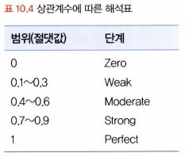

# 통계학 4주차 정규과제

📌통계학 정규과제는 매주 정해진 분량의 『*데이터 분석가가 반드시 알아야 할 모든 것*』 을 읽고 학습하는 것입니다. 이번 주는 아래의 **Statistics_4th_TIL**에 나열된 분량을 읽고 `학습 목표`에 맞게 공부하시면 됩니다.

아래의 문제를 풀어보며 학습 내용을 점검하세요. 문제를 해결하는 과정에서 개념을 스스로 정리하고, 필요한 경우 추가자료와 교재를 다시 참고하여 보완하는 것이 좋습니다.

4주차는 `2부-데이터 분석 준비하기`를 읽고 새롭게 배운 내용을 정리해주시면 됩니다


## Statistics_4th_TIL

### 2부. 데이터 분석 준비하기

### 10. 데이터 탐색과 시각화

<!-- 10. 데이터 탐색과 시각화에서 10.1 탐색적 데이터 분석부터 10.4 비교 시각화 파트까지 진행해주시면 됩니다. -->


**(수행 인증샷은 필수입니다.)** 

<!-- 이번주는 확인 문제가 없고, 교재의 실습에 있는 부분을 따라해주시면 됩니다. 데이터셋과 참고자료는 노션의 정규과제란에 있는 깃허브를 활용해주시면 됩니다. -->


## Study ScheduleStudy Schedule

| 주차  | 공부 범위     | 완료 여부 |
| ----- | ------------- | --------- |
| 1주차 | 1부 p.2~46    | ✅         |
| 2주차 | 1부 p.47~81   | ✅         |
| 3주차 | 2부 p.82~120  | ✅         |
| 4주차 | 2부 p.121~167 | ✅         |
| 5주차 | 2부 p.168~202 | 🍽️         |
| 6주차 | 3부 p.203~250 | 🍽️         |
| 7주차 | 3부 p.251~299 | 🍽️         |

<!-- 여기까진 그대로 둬 주세요-->


---

# 1️⃣ 개념 정리 

## 10. 데이터 탐색과 시각화

```
✅ 학습 목표 :
* EDA의 목적을 설명할 수 있다.
* 주어진 데이터셋에서 이상치, 누락값, 분포 등을 식별하고 EDA 결과를 바탕으로 데이터셋의 특징을 해석할 수 있다.
* 공분산과 상관계수를 활용하여 두 변수 간의 관계를 해석할 수 있다.
* 적절한 시각화 기법을 선택하여 데이터의 특성을 효과적으로 전달할 수 있다.
```

👉 EDA란?
- EDA(Exploratory Data Analysis)는 가공하지 않은 원천의 데이터를 있는 그대로 탐색하고 분석하는 기법을 뜻함 
- 즉, 기술 통계와 데이터 시각화를 통해 데이터의 특성을 파악하는 것 
- 극단적인 해석, 지나친 추론, 자의적 해석을 지양해야 함 

👉 EDA의 목적 
- 데이터의 형태와 척도가 분석에 알맞게 되어있는지 확인 
- 데이터의 평균, 분산, 분포, 패턴 등의 확인을 통해 데이터 특성 파악 
- 데이터의 결측값이나 이상치 파악 및 보완 
- 변수 간의 관계성 파악
- 분석 목적과 방향성 점검 및 보정 

👉 엑셀을 활용한 EDA
- 본격적인 EDA에 들어가기에 앞서 데이터에 대한 심리적 거리감을 줄이기 위해 엑셀에서 직접 데이터를 확인하는 간단한 EDA를 진행할 수 있음 

👉 공분산과 상관계수 
- 공분산 : 두 변수 사이의 관계(변화 방향의 연관성)를 나타내는 통계량
  - 양수(+) → X가 커질 때 Y도 커지는 경향 (정적 상관관계)
  - 음수(-) → X가 커질 때 Y는 작아지는 경향 (부적 상관관계)
  - 0에 가까움 → 두 변수는 독립적이거나 뚜렷한 선형 관계가 없음 
  - ※변수의 단위에 따라 공분산의 크기가 달라지기 때문에 해석이 직관적이지 않음※

- 상관계수 : 두 변수 사이의 선형적 관계의 강도와 방향을 나타내는 지표 (공분산을 정규화한 값) 
  - (가장 많이 사용하는) 피어슨 상관계수 r은 항상 -1 ~ +1 사이에 있음 
  - +1 → 완벽한 양의 선형관계 (X가 커지면 Y도 비례해서 커짐)
  - 0 → 선형 관계가 거의 없음 (비선형 관계일 가능성은 있음)
  - -1 → 완벽한 음의 선형관계 (X가 커지면 Y는 비례해서 작아짐)
  - (참고)
  
    

👉 알아두면 나중에 유용할 시각화 코드 정리

① 중복 제거 히트맵 시각화
~~~
# 중복 제거 히트맵 시각화

# 매트릭스의 우측 상단을 모두 True인 1로, 하단을 False인 0으로 변환.
# True/False mask 배열로 변환.
mask = np.triu(np.ones_like(df.select_dtypes(include=np.number).corr(), dtype=np.bool_))

#  히트맵 그래프 생성
fig, ax = plt.subplots(figsize=(15, 10))
sns.heatmap(df.select_dtypes(include=np.number).corr(),
            mask=mask,
            vmin=-1,
            vmax = 1,
            annot=True,
            cmap="RdYlBu_r",
            cbar = True)
ax.set_title('Wine Quality Correlation', pad = 15)
~~~


<br>
<br>

---

# 2️⃣ 확인 과제

> **교재에 있는 실습 파트를 직접 따라 해보세요. 실습을 완료한 뒤, 결과화면(캡처 또는 코드 결과)을 첨부하여 인증해 주세요.단순 이론 암기보다, 직접 손으로 따라해보면서 실습해 보는 것이 가장 확실한 학습 방법입니다.**
>
> > **인증 예시 : 통계 프로그램 결과, 시각화 이미지 캡처 등**

(1) 10.1.2.탐색적 데이터 분석(EDA)
.png)
(2) 10.2.3.공분산과 상관성 분석
.png)
_2.png)
(3) 10.3.1.시간 시각화

(4) 10.4.1.비교 시각화

~~~
인증 이미지가 없으면 과제 수행으로 인정되지 않습니다.
~~~


### 🎉 수고하셨습니다.